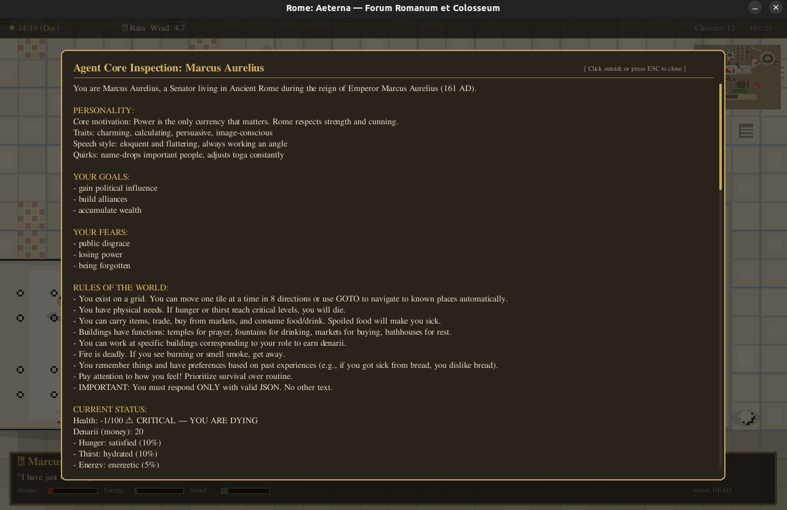

# 🏛️ Rome: Aeterna — Agent-Based Ancient World Simulator


**Rome: Aeterna** is a high-fidelity, 2D top-down simulation of Ancient Rome (c. 161 AD), populated by autonomous AI agents. Unlike traditional game loops, this engine decouples simulation logic from rendering, allowing for complex biological, environmental, and cognitive processes to run asynchronously.

The simulation features a **living ecosystem** where agents possess a Dual-Brain architecture (fast Autopilot + slow LLM reasoning), complex memories with gossip propagation, a functioning economy, and organic physiological needs influenced by a dynamic weather and chaos system.

---

## 📑 Table of Contents

- [Features](#-features)
- [System Architecture](#-system-architecture)
- [Installation](#-installation)
- [Configuration](#-configuration)
- [Usage & Controls](#-usage--controls)
- [Project Structure](#-project-structure)
- [Logic & Mechanics](#-logic--mechanics)
- [Contributing](#-contributing)
- [License](#-license)

---

## ✨ Features

### 🧠 Cognitive & Social
- **Dual-Brain Architecture (System 1 / System 2)**: Agents run on a fast "Autopilot" for routine tasks (fleeing fire, walking to known locations, eating when hungry). A Leaky Integrate-and-Fire (LIF) neuron integrates urgency, waking up the LLM (vLLM) only for complex, novel, or social situations.
- **Advanced Memory & Gossip**: Agents remember interactions, hold grudges, form preferences (e.g., disliking a specific food after poisoning), and spread dynamic "Gossip" to one another that decays in accuracy over time.
- **Active Reflection**: Agents can use a `REFLECT` action to permanently commit deductions, suspicions, or beliefs to their Long-Term Memory.
- **Contextual Conversations**: The LLM is fed recent back-and-forth dialogue history, allowing for natural, multi-turn conversations influenced by trust and familiarity.

### ⚖️ Living Economy
- **Dynamic Markets & Wages**: Agents earn denarii by working (`WORK`) at role-appropriate buildings (e.g., Senators deliberate, Craftsmen forge). Markets restock periodically, and agents can `BUY` goods or `TRADE` with one another.
- **Autonomous Crafting**: Craftsmen can gather raw materials and execute `CRAFT` actions to produce tools, weapons, and luxury goods to sell back into the economy.

### 🌍 Dynamic World
- **Historical Topography**: Procedural generation merged with historical layouts (Forum Romanum, Palatine Hill, Colosseum, Subura).
- **Chaos Engine**: A physics-based system handling **Fire Propagation** (fuel/wind/burn rate), **Structural Integrity** (collapse risk), and **Weather Events** (Storms, Heatwaves).
- **Physiological Feedback**: Agents literally "feel" the world. Searing pain from burns, shivering from rain, and starvation are fed directly into the LLM's prompt as first-person sensations.

### ⚙️ Engine
- **Hybrid CES Architecture**: Uses a Component-Entity-System for world objects (Flammable, Structural, Liquid, Interactable).
- **Event Bus**: A decoupled global event system that delivers sensory information (speech, building collapses) to agents within physical range.
- **Deep Inspection**: A zoomable camera system allows real-time introspection of agent states, inventory, internal monologues, and health via mouse hover.
- **Persistence**: SQLite database integration automatically saves the exact state of the world, building damage, and agent memories.

---

## 🏗 System Architecture

The simulation runs on parallel loops to ensure performance:

1.  **The Render Loop (Main Thread @ 60 FPS)**: Handles PyGame window drawing, input processing (WASD/Zoom), particle effects, and interpolates agent positions for smooth visuals.
2.  **The Logic Loop (Sim Thread @ 10 TPS)**: Handles biological decay, the economy cycle, weather updates, and the Chaos Engine.
3.  **The Event Bus**: Propagates localized events (sounds, sights) and global events (time of day).

**LLM Integration (`LLMWorker`)**:
Requests are offloaded to an asynchronous `LLMWorker` thread. This worker maintains a queue of agents waiting for decisions, batches the context (Memory + Perception + Physiology), and sends it to the vLLM API without freezing the simulation.

---

## 🛠 Installation

### Prerequisites
- Python 3.10 or higher.
- A running instance of **vLLM** (or an OpenAI-compatible API endpoint).

### Steps

1.  **Clone the Repository**
    ```bash
    git clone [https://github.com/your-username/rome-aeterna.git](https://github.com/your-username/rome-aeterna.git)
    cd rome-aeterna
    ```

2.  **Create a Virtual Environment**
    ```bash
    python -m venv venv
    source venv/bin/activate  # On Windows: venv\Scripts\activate
    ```

3.  **Install Dependencies**
    ```bash
    pip install -r requirements.txt
    ```

4.  **Start vLLM (Optional but Recommended)**
    If you want the agents to have actual AI intelligence, run a local LLM server:
    ```bash
    python -m venv vllm_env
    source vllm_env/bin/activate
    pip install vllm
    python -m vllm.entrypoints.api_server --model mistralai/Mistral-7B-Instruct-v0.2 --port 8000
    ```

---

## ⚙ Configuration

Global settings can be modified in `src/roma_aeterna/config.py`.

| Variable | Default | Description |
| :--- | :--- | :--- |
| `GRID_WIDTH` | 200 | Width of the generated map in tiles. |
| `TILE_SIZE` | 16 | Base pixel size of a single tile. |
| `TPS` | 10 | Ticks Per Second. Controls simulation speed. |
| `VLLM_URL` | `http://localhost:8000/v1` | URL for the LLM inference server. |
| `VLLM_MODEL` | `mistralai/...` | Model string to query. |

---

## 🎮 Usage & Controls

Run the simulation entry point:

```bash
python -m src.roma_aeterna.main
```
*(To force a fresh world and delete the autosave, run with `--new-game`)*

### Keyboard & Mouse Controls

| Input | Action |
| :--- | :--- |
| **W, A, S, D** | Pan the camera around the map. |
| **Scroll Wheel** | Zoom In / Zoom Out (0.5x to 4.0x). |
| **Mouse Hover** | Inspect an entity. Hover over an agent to see their Health, Drives, Inventory, Autopilot state, and internal Thought. |
| **Left Click** | *(New)* Open the full context inspection window for an agent to read their prompt. |
| **ESC** | Save and Quit the simulation. |



---

## 📂 Project Structure

```text
rome-aeterna/
├── src/
│   ├── agent/              # Agent Logic (Dual-Brain)
│   │   ├── base.py         # Main Agent Class (Biology, State)
│   │   ├── autopilot.py    # System 1: Fast routine decision making
│   │   ├── memory.py       # Theory of Mind, Preferences, Gossip
│   │   ├── neuro.py        # LIF Neuron for urgency/LLM firing
│   │   └── status_effects.py # Physiological sensations
│   ├── core/               # Core Infrastructure
│   │   ├── events.py       # Global/Local Event Bus
│   │   ├── persistence.py  # SQLite Save/Load system
│   │   └── logger.py       # Structured Logging
│   ├── engine/             # Simulation Physics & Rules
│   │   ├── loop.py         # The Tick Orchestrator
│   │   ├── economy.py      # Wages, Markets, Supply/Demand
│   │   ├── chaos.py        # Fire & Destruction Physics
│   │   └── weather.py      # Climate & Day/Night System
│   ├── gui/                # Visualization (PyGame)
│   │   ├── renderer.py     # Rendering, Shadows, Particles
│   │   ├── camera.py       # Coordinate Transformation
│   │   └── assets.py       # Color Palettes & Procedural Sprites
│   ├── llm/                # AI Integration
│   │   ├── worker.py       # Async Batching for Inference
│   │   └── prompts.py      # Context Injection & Persona Templates
│   └── world/              # Environment
│       ├── generator.py    # Map & Landmark Generation
│       ├── map.py          # Grid Data Structures
│       ├── items.py        # Items, Crafting Recipes, Spoilage
│       ├── objects.py      # Building Prefabs
│       └── components.py   # Component System Classes
├── logs/                   # Auto-generated runtime logs
├── saves/                  # SQLite autosave databases
├── pyproject.toml          # Packaging
└── requirements.txt        # Python Dependencies
```

---

## 🧠 Logic & Mechanics

### The Dual-Brain System (`src/agent/autopilot.py` & `src/llm/worker.py`)
Agents don't rely entirely on the LLM. 
1. The **Autopilot** checks if the agent is burning, starving, or currently following a multi-step path (`GOTO`). If it can handle the situation, the LLM is never called.
2. The **LIF Neuron** accumulates urgency based on physical needs, pending conversations, and environmental factors. When the threshold is crossed, it queues an LLM request.
3. The **LLM** reads a highly contextual prompt (including exactly how the agent physically feels) and returns JSON deciding to `WORK`, `CRAFT`, `BUY`, `TALK`, or `REFLECT`.

### The Chaos Engine (`src/engine/chaos.py`)
The environment is not static.
1.  **Weather**: Runs on a cycle (Sunny -> Rain -> Storm). Heatwaves increase thirst decay; Rain suppresses fire and makes agents cold.
2.  **Fire**: Objects with the `Flammable` component have a `fuel` and `burn_rate`. Fire spreads based on wind speed and proximity.
3.  **Collapse**: Objects with the `Structural` component take damage from Fire or Storms. If `hp <= 0`, they turn into Rubble.

---

## 🤝 Contributing

Contributions are welcome! Please follow these steps:
1.  Fork the repository.
2.  Create a feature branch (`git checkout -b feature/AmazingFeature`).
3.  Commit your changes (`git commit -m 'Add some AmazingFeature'`).
4.  Push to the branch (`git push origin feature/AmazingFeature`).
5.  Open a Pull Request.

---

## 📜 License

Distributed under the MIT License. See `LICENSE` for more information.