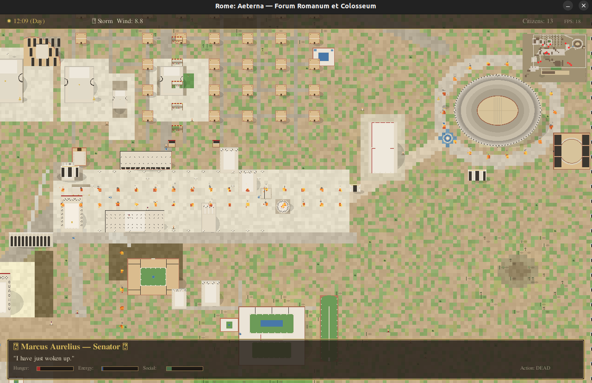

# Rome: Aeterna — Agent-Based Ancient World Simulator




**Rome: Aeterna** is a high-fidelity, 2D top-down simulation of the ancient world populated by autonomous AI agents. Unlike traditional game loops, this engine decouples simulation logic from rendering, allowing complex biological, environmental, and cognitive processes to run asynchronously.

Agents possess a **Dual-Brain architecture** — a fast Autopilot for routine behaviour and slow LLM reasoning for novel situations — layered on top of real physiological drives, a functioning economy, gossip networks, and an interactive chaos/weather system.

---

## Table of Contents

- [Features](#features)
- [System Architecture](#system-architecture)
- [Scenarios](#scenarios)
- [Installation](#installation)
- [Configuration](#configuration)
- [Usage & Controls](#usage--controls)
- [Project Structure](#project-structure)
- [Logic & Mechanics](#logic--mechanics)
- [Contributing](#contributing)
- [License](#license)

---

## Features

### Cognitive & Social
- **Dual-Brain Architecture (System 1 / System 2)** — Agents run on a fast Autopilot for routine tasks (fleeing fire, walking to known locations, eating when hungry). A Leaky Integrate-and-Fire (LIF) neuron integrates urgency and wakes the LLM only for complex, novel, or social situations.
- **Advanced Memory & Gossip** — Agents remember interactions, form preferences (e.g., disliking a food after being poisoned), and spread dynamic gossip that decays in accuracy over time.
- **Active Reflection** — Agents can use `REFLECT` to permanently commit deductions or beliefs to long-term memory.
- **Oracle / Temple System** — Agents can `PRAY` at temples; a renderer overlay accepts player-typed divine responses that affect the agent's memory and urgency.

### Living Economy
- **Dynamic Markets & Wages** — Agents earn denarii at role-appropriate workplaces. Markets restock periodically; agents can `BUY` goods or `TRADE` with one another.
- **Crafting** — Craftsmen execute `CRAFT` actions to produce tools and goods from raw materials.

### Dynamic World
- **Scenario System** — The engine is scenario-agnostic. Swap the active map by changing one line in `config.py`. Two scenarios are included: the full historical city of Rome (200×150 tiles) and the Flavian Amphitheatre gladiator arena (80×60 tiles).
- **Historical Topography** — Procedural generation guided by historical layouts: Forum Romanum, Palatine Hill, Colosseum, Circus Maximus, Subura, Theatre of Marcellus.
- **Chaos Engine** — Physics-based fire propagation (fuel/burn rate/wind), structural integrity (collapse risk), and weather events (storms, heatwaves, rain).
- **Physiological Feedback** — Burns, starvation, and thirst are injected into the LLM prompt as first-person sensations.
- **Rich Interactions** — Most world objects are interactable: pray at temples, drink from fountains, forage olives, rest in shade, read public records, or spectate events.

### Engine
- **ECS World Objects** — Component-Entity-System for buildings and decorations (`Flammable`, `Structural`, `Liquid`, `WaterFeature`, `Interactable`, …).
- **A\* Pathfinding** — Road-biased A\* with partial-path fallback and per-agent novelty timeouts to prevent GOTO loops.
- **Event Bus** — Decoupled event system delivering sensory information (speech, fire, collapses) to agents within physical range.
- **Deep Inspection** — Mouse-hover tooltips and a full-screen agent window exposing prompt history, decision history, and internal monologue.
- **Persistence** — Autosave/load via JSON serialisation (configurable interval).
- **Session Logging** — Structured JSONL logging of every LLM call, agent state snapshot, and outcome for post-hoc analysis.

---

## System Architecture

Three concurrent loops keep rendering smooth while the simulation and LLM run independently:

1. **Render loop** (main thread, 60 FPS) — PyGame input, drawing, camera, particles. Reads engine state under `engine.lock`.
2. **Sim loop** (called by renderer at 30 TPS) — Biology, economy, weather, chaos, and the dual-brain decision flow for each agent.
3. **LLM worker** (daemon thread) — Asyncio event loop. Dequeues agents needing inference, calls the LLM API (Gemini or OpenAI-compatible), and applies decisions back to agents.

All shared state is protected by `engine.lock` (a `threading.RLock`).

**Per-agent decision flow each tick:**
```
update_biological() → LIF neuron fires?
    ├─ No  → if path exists: autopilot._follow_path() → MOVE
    └─ Yes → autopilot.decide()
                 ├─ Returns decision → _execute_autopilot_decision()   (System 1)
                 └─ Returns None     → agent.waiting_for_llm = True
                                           └─ build_prompt() → LLM → _apply_decision()  (System 2)
```

---

## Scenarios

The scenario selected in `config.py` controls the map, initial agents, and animals. Switching requires a `--new-game` restart (save files are scenario-specific).

### `rome` (default)
Historical Rome c. 161 AD, during the reign of Marcus Aurelius. A 200×150 tile map covering roughly 1 km² of central Rome including:
- Forum Romanum, Imperial Fora, Colosseum complex
- Palatine and Capitoline Hills
- Circus Maximus, Subura, Theatre of Marcellus
- 455+ world objects, 8 named characters + legionary contubernium

### `gladiator_arena`
The Flavian Amphitheatre c. 80 AD — a compact 80×60 tile map focused on the arena itself:
- Four elliptical terrain layers: outer wall → spectator concourse → inner podium wall → sand fighting floor
- North/south entrance tunnels (Gate of Life / Gate of Death)
- Armory (west) and Medical Tent (east) in the north forecourt
- Spartacus, Crixus, Batiatus (lanista), Galen (physician), arena guards, wolves, and a boar

To switch scenarios, edit `config.py`:
```python
SCENARIO = "gladiator_arena"  # or "rome"
```

Adding a new scenario means subclassing `BaseScenario` in `world/scenarios/` and registering it in `SCENARIO_REGISTRY`.

---

## Installation

### Prerequisites
- Python 3.10 or higher
- An LLM backend — either a **Gemini API key** (default, zero local setup) or a running **OpenAI-compatible endpoint** such as vLLM

### Steps

1.  **Clone the Repository**
    ```bash
    git clone [https://github.com/your-username/rome-aeterna.git](https://github.com/your-username/rome-aeterna.git)
    cd rome-aeterna
    ```

2.  **Create a Virtual Environment**
    ```bash
    python -m venv venv
    source venv/bin/activate  # On Windows: venv\Scripts\activate
    ```

3.  **Install Dependencies**
    ```bash
    pip install -r requirements.txt
    ```

4.  **Start vLLM**
    If you want the agents to have actual AI intelligence, run a local LLM server:
    ```bash
    vllm serve Qwen/Qwen3-30B-A3B-GPTQ-Int4 \
      --download-dir "/path/to/your/models" \
      --port 8000 \
      --max-model-len 4096 \
      --gpu-memory-utilization 0.9 \
      --max-num-seqs 16 
    ```

---

## Configuration

All global tuning lives in `src/roma_aeterna/config.py`. Key settings:

| Variable | Default | Description |
| :--- | :--- | :--- |
| `SCENARIO` | `"rome"` | Active scenario: `"rome"` or `"gladiator_arena"` |
| `N_AGENTS` | `2` | Random citizens to spawn on top of named characters |
| `TPS` | `30` | Simulation ticks per second |
| `GRID_WIDTH` / `GRID_HEIGHT` | `200` / `150` | Default map dimensions (Rome scenario) |
| `TILE_SIZE` | `16` | Base pixel size of one tile |
| `LLM_PROVIDER` | `"gemini"` | `"gemini"` or `"openai"` (any OpenAI-compat endpoint) |
| `LLM_MODEL` | `"gemini-flash-lite-latest"` | Model identifier passed to the provider |
| `LLM_BASE_URL` | `"http://localhost:8000/v1"` | Base URL for OpenAI-compat provider |
| `PERCEPTION_RADIUS` | `8` | Tiles an agent can see |
| `RANDOM_SEED` | `755` | Procedural generation seed |

Environment variables override config at runtime:
```bash
export LLM_PROVIDER=openai
export LLM_MODEL=Qwen/Qwen3-4B-AWQ
export LLM_BASE_URL=http://localhost:8000/v1
```

---

## Usage & Controls

```bash
python -m roma_aeterna.main              # Resume from autosave
python -m roma_aeterna.main --new-game   # Delete save and start fresh
```

### Keyboard & Mouse

| Input | Action |
| :--- | :--- |
| **W A S D** | Pan camera |
| **Scroll Wheel** | Zoom in / out (0.5× – 4.0×) |
| **Mouse Hover** | Inspect entity — shows health, drives, inventory, and last thought |
| **Right Click** on agent | Context menu — open prompt view or decision history |
| **Left Click** on agent | Open full agent inspection window |
| **ESC** | Close inspection window / quit |

### Session Log Viewer

Every LLM call and agent state snapshot is logged to `logs/session.jsonl`:

```bash
python -m roma_aeterna.tools.log_viewer logs/session.jsonl
python -m roma_aeterna.tools.log_viewer logs/session.jsonl --agent "Marcus Aurelius"
python -m roma_aeterna.tools.log_viewer logs/session.jsonl --type llm_response
python -m roma_aeterna.tools.log_viewer logs/session.jsonl --summary
python -m roma_aeterna.tools.log_viewer logs/session.jsonl --failures
```

---

## Project Structure

```text
roma_aeterna/
├── src/
│   └── roma_aeterna/
│       ├── main.py                  # Entry point — scenario selection and startup
│       ├── config.py                # All global tuning parameters
│       ├── agent/
│       │   ├── base.py              # Agent state (biology, inventory, position)
│       │   ├── autopilot.py         # System 1 — fast routine decisions
│       │   ├── neuro.py             # Leaky Integrate-and-Fire neuron
│       │   ├── memory.py            # Short/long-term memory, gossip, locations
│       │   ├── perception.py        # PerceptionSystem — scans nearby objects/agents
│       │   ├── pathfinding.py       # A* pathfinder with road bias
│       │   ├── interactions.py      # execute_interaction() — all itype branches
│       │   ├── recording.py         # DecisionRecorder — prompt/LLM/history logs
│       │   ├── status_effects.py    # StatusEffectManager — multipliers and bonuses
│       │   ├── constants.py         # VALID_ACTIONS, DIRECTION_DELTAS
│       │   └── animal.py            # Animal agents (wolf, dog, boar, raven)
│       ├── core/
│       │   ├── events.py            # EventBus — localised and global events
│       │   └── persistence.py       # JSON autosave / load
│       ├── engine/
│       │   ├── loop.py              # SimulationEngine — tick orchestrator
│       │   ├── economy.py           # Wages, markets, restocking
│       │   ├── chaos.py             # Fire propagation, structural damage
│       │   └── weather.py           # Climate and day/night cycle
│       ├── gui/
│       │   ├── renderer.py          # PyGame rendering — tiles, objects, agents, UI
│       │   ├── camera.py            # Coordinate transforms and pan/zoom
│       │   └── assets.py            # Color palettes and procedural sprites
│       ├── llm/
│       │   ├── worker.py            # LLMWorker — async batching and dispatch
│       │   ├── actions.py           # ActionExecutor — all 16 action handlers
│       │   ├── prompts.py           # build_prompt() — 6-zone context assembly
│       │   ├── personalities.py     # Personality templates and starting inventories
│       │   ├── parser.py            # JSON extraction from raw LLM output
│       │   └── mock.py              # MockDecisionMaker — fallback when LLM unavailable
│       ├── world/
│       │   ├── generator.py         # WorldGenerator — 14-phase historical Rome map
│       │   ├── map.py               # GameMap and Tile data structures
│       │   ├── objects.py           # WorldObject and 50+ building prefabs
│       │   ├── components.py        # ECS components (Flammable, Structural, …)
│       │   ├── items.py             # Item, Recipe, ItemDatabase
│       │   └── scenarios/
│       │       ├── base.py          # BaseScenario abstract class
│       │       ├── rome.py          # RomeScenario — full historical city
│       │       ├── arena.py         # GladiatorArenaScenario — Colosseum arena
│       │       └── _utils.py        # Shared name generator and spawn-point finder
│       └── tools/
│           ├── log_viewer.py        # CLI log analysis tool
│           ├── agent_logger.py      # Background JSONL logger
│           └── agent_diagnostics.py # Terminal diagnostics (every N seconds)
├── logs/                            # Runtime session logs (JSONL)
├── saves/                           # Autosave files
└── pyproject.toml                   # Package metadata and dependencies
```

---

## Logic & Mechanics

### The Dual-Brain System

Agents don't call the LLM every tick — most decisions are handled locally:

1. **Autopilot** checks for critical needs (fire nearby, thirst > 70, hunger > 70, energy > 85) and handles them using memorised locations. If the agent is mid-journey it continues following the A\* path.
2. **LIF Neuron** accumulates weighted urgency from drives (hunger, thirst, social, energy) plus environmental signals (fire proximity, night outdoors, nearby critical agents). When potential ≥ role-specific threshold it fires and escalates to the LLM.
3. **LLM** receives a structured 6-zone prompt (identity → state → world → recent past → mind → conscience) and returns a JSON decision: `WORK`, `CRAFT`, `BUY`, `TRADE`, `TALK`, `GOTO`, `REFLECT`, `PRAY`, `ATTACK`, etc.

### Prompt Structure

Six named zones are assembled per LLM call:
1. **WHO YOU ARE** — identity, personality, goals, fears, world rules
2. **YOUR STATE** — health/drives/position, current action, inventory
3. **THE WORLD** — nearby buildings/agents, market listings if applicable, incoming conversation
4. **RECENT PAST** — decision history, event outcomes, drive trends
5. **YOUR MIND** — important memories, recent memories, personal notes, relationships, known locations
6. **YOUR CONSCIENCE** — urgency warnings, stagnation hints, vita activa encouragement

### Chaos Engine

The environment degrades and reacts:
- **Weather** cycles through Sunny → Rain → Storm (each lasting 1.7–6.7 minutes at TPS=30). Heatwaves accelerate thirst; rain suppresses fire.
- **Fire** spreads between `Flammable` objects based on fuel, burn rate, and proximity. Decorative torches are flagged `is_decorative` and ignored by the chaos engine.
- **Collapse** — `Structural` objects take damage from fire and storms; at 0 HP they become rubble.

### Memory

Each agent has a short-term cap (20) and long-term cap (50). When short-term overflows, the lowest-importance entry is evicted (promoted to long-term if importance ≥ 3.0, else discarded). Walk events (importance 0.5) are filtered from the prompt to prevent noise drowning out conversations and purchases.

---

## Contributing

Contributions are welcome. Please:
1. Fork the repository.
2. Create a feature branch (`git checkout -b feature/your-feature`).
3. Commit your changes (`git commit -m 'Add your feature'`).
4. Push and open a Pull Request.

---

## License

Distributed under the MIT License. See `LICENSE` for more information.
